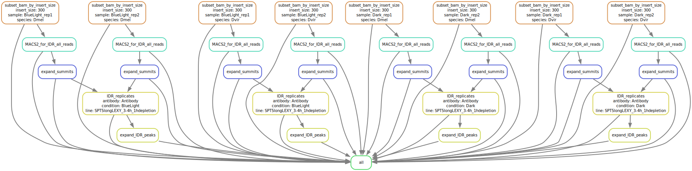

# Depletion CUT&Tag Snakemake Pipeline

This repository contains a **Snakemake pipeline** for peak calling of Depletion CUT&Tag data. The pipeline is designed to be run on a high-performance computing (HPC) cluster and includes job submission configurations and a wrapper script for execution.

---

### Repository Structure

```bash
.
├── Snakefile             # Main Snakemake workflow
├── cluster.json          # Cluster submission configuration (e.g., memory, threads)
├── run_snakemake.sh      # Shell script to execute the pipeline
└── README.md             # This file

```

## Depletion CUT&Tag Snakemake QC & Mapping Pipeline

### Overview

This repository contains a **Snakemake pipeline** for peak calling of Depletion CUT&Tag data. The pipeline is designed to be run on a high-performance computing (HPC) cluster and includes job submission configurations and a wrapper script for execution.

The pipeline is modular, supports SLURM-based clusters.

### Pipeline Steps

- **Filter BAM by insert size** using `samtools`
- **Peak calling** using `macs2`
- **Irreproducible Discovery Rate** using `idr`

### Pipeline Overview

A schematic overview of the pipeline is illustrated in the following SVG:



### Conda Environment

The pipeline uses a dedicated Conda environment defined in `Depletion_CUTnTag_config.yml`:

### Tools and Versions

| Tool           | Version  |
|----------------|----------|
| samtools       | 1.16.1   |
| macs2          | 2.2.7.1  |
| idr            | 02.0.4.2 |

---

### Running the Workflow

To execute the pipeline on an HPC cluster using SLURM, use the provided run_snakemake.sh script.

<pre>sbatch run_snakemake.sh</pre>
