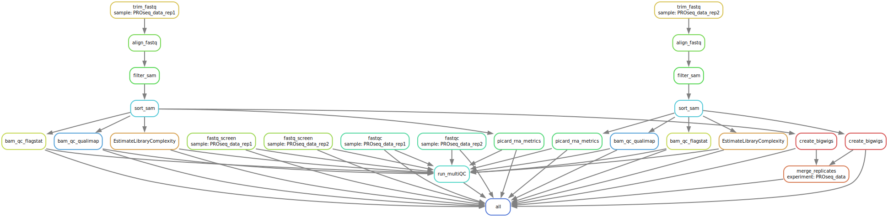

# PRO-seq Snakemake Pipeline

This repository contains a **Snakemake pipeline** for processing and analyzing PRO-seq data. The pipeline is designed to be run on a high-performance computing (HPC) cluster and includes job submission configurations and a wrapper script for execution.

---

### Repository Structure

```bash
.
├── Snakefile             # Main Snakemake workflow
├── cluster.json          # Cluster submission configuration (e.g., memory, threads)
├── run_snakemake.sh      # Shell script to execute the pipeline
└── README.md             # This file

```

## PRO-seq Snakemake QC & Mapping Pipeline

### Overview

This Snakemake pipeline performs preprocessing, mapping, and quality control (QC) of PRO-seq data. It is designed to handle single-end fastq files from Drosophila embryos including trimming, alignment, deduplication, QC reports, and bigWig generation.

The pipeline is modular, supports SLURM-based clusters.

### Pipeline Steps

- **Read trimming** using `cutadapt`
- **Mapping** using `bwa` and `bowtie2` (for fastq_screen)
- **Filtering and deduplication** using `samtools`, `umi_tools`, and `picard`
- **QC reporting** using `fastqc`, `multiqc`, `qualimap`, and `picard`
- **bigWig file creation** using `deeptools`
- **Sample correlation** and quality metrics

### Pipeline Overview

A schematic overview of the pipeline is illustrated in the following SVG:



### Conda Environment

The pipeline uses a dedicated Conda environment defined in `PROseq_config.yml`:

### Tools and Versions

| Tool           | Version  |
|----------------|----------|
| deeptools      | 3.5.5    |
| bwa            | 0.7.17   |
| cutadapt       | 4.1      |
| samtools       | 1.15.1   |
| picard         | 2.18.17  |
| fastqc         | 0.11.9   |
| multiqc        | 1.13     |
| qualimap       | 2.3      |
| umi_tools      | 1.1.6    |
| fastq-screen   | 0.15.2   |
| bowtie         | 1.3.1    |
| bowtie2        | 2.4.5    |

---

### Running the Workflow

To execute the pipeline on an HPC cluster using SLURM, use the provided run_snakemake.sh script.

<pre>sbatch run_snakemake.sh</pre>
