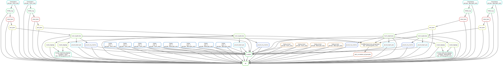

# RNA-seq Snakemake Pipeline

This repository contains a **Snakemake pipeline** for processing and analyzing RNA-seq data. The pipeline is designed to be run on a high-performance computing (HPC) cluster and includes job submission configurations and a wrapper script for execution.

---

### Repository Structure

```bash
.
├── Snakefile             # Main Snakemake workflow
├── cluster.json          # Cluster submission configuration (e.g., memory, threads)
├── run_snakemake.sh      # Shell script to execute the pipeline
└── README.md             # This file

```

## RNA-seq Snakemake QC & Mapping Pipeline

### Overview

This repository contains a **Snakemake pipeline** for processing and analyzing RNA-seq data. The pipeline is designed to be run on a high-performance computing (HPC) cluster and includes job submission configurations and a wrapper script for execution.

The pipeline is modular, supports SLURM-based clusters.

### Pipeline Steps

- **Read trimming** using `trimgalore`
- **Mapping to D.mel genome** using `STAR` and `bowtie2` (for fastq_screen)
- **Filtering and deduplication** using `samtools` and `picard`
- **bigWig file creation** using deeptools
- **QC reporting** using `samtools`, `picard`, `deeptools`, `fastqc` and `multiqc` 
- **Sample correlation** and quality metrics


### Pipeline Overview

A schematic overview of the pipeline is illustrated in the following SVG:



### Conda Environment

The pipeline uses a dedicated Conda environment defined in `RNAseq_config.yml`:

### Tools and Versions

| Tool           | Version  |
|----------------|----------|
| trimgalore     | 0.6.7    |
| STAR           | 2.7.9    |
| picard         | 2.16.0   |
| samtools       | 1.9      |
| deeptools      | 3.5.0    |
| fastqc         | 0.11.8   |
| fastq_screen   | 0.15.2   |
| bowtie2        | 2.4.5    |
| multiqc        | 1.13     |

---

### Running the Workflow

To execute the pipeline on an HPC cluster using SLURM, use the provided run_snakemake.sh script.

<pre>sbatch run_snakemake.sh</pre>
