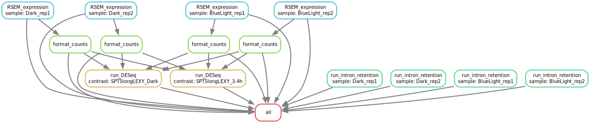

# RNA-Seq DESeq Snakemake Pipeline

This repository contains a **Snakemake pipeline** for analyzing RNA-seq data. The pipeline is designed to be run on a high-performance computing (HPC) cluster and includes job submission configurations and a wrapper script for execution.

---

### Repository Structure

```bash
.
├── Snakefile             # Main Snakemake workflow
├── cluster.json          # Cluster submission configuration (e.g., memory, threads)
├── run_snakemake.sh      # Shell script to execute the pipeline
└── README.md             # This file

```

## RNA-Seq DESeq Snakemake Pipeline

### Overview

This repository contains a **Snakemake pipeline** for analyzing RNA-seq data. The pipeline is designed to be run on a high-performance computing (HPC) cluster and includes job submission configurations and a wrapper script for execution.

The pipeline is modular, supports SLURM-based clusters.

### Pipeline Steps

- **RSEM calculation of expression** using `RSEM`
- **Differential expression analysis** using `DESeq` 
- **Intron retention** using `iREAD` 

### Pipeline Overview

A schematic overview of the pipeline is illustrated in the following SVG:



### Conda Environment

The pipeline uses a dedicated Conda environment defined in `RNAseq_config.yml`:

### Tools and Versions

| Tool           | Version  |
|----------------|----------|
| RSEM           | 1.3.3    |
| DESeq          | 1.38.3   |
| iREAD          | 0.8.9    |

---

### Running the Workflow

To execute the pipeline on an HPC cluster using SLURM, use the provided run_snakemake.sh script.

<pre>sbatch run_snakemake.sh</pre>
